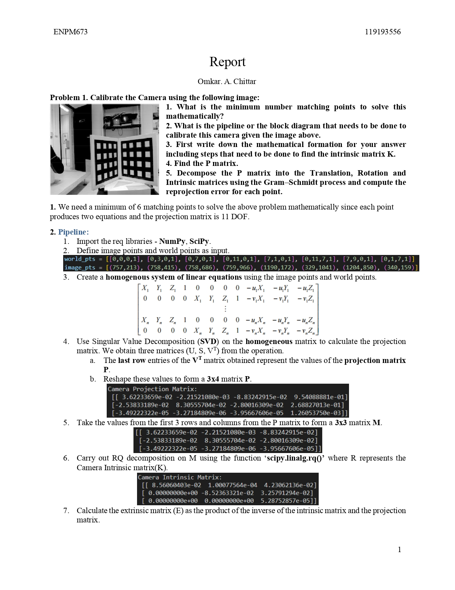
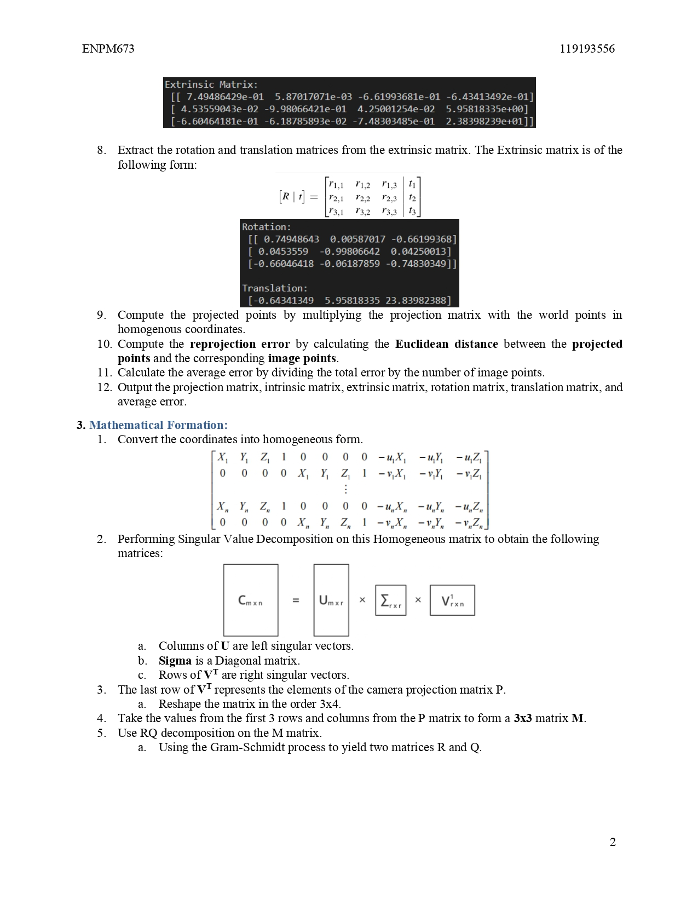
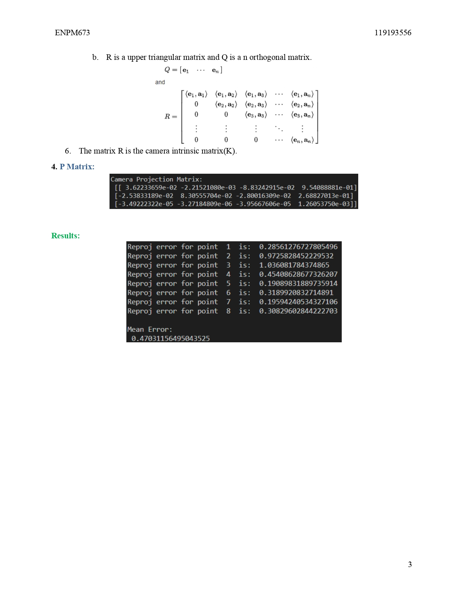

# Tsai Camera Calibration

## **Installation and Running**
1. Download and extract the files.

2. Run the code Problem_1.py using the following command in your terminal
    ***python3 Problem_1.py***
**The terminal displays the following**:
 - Camera Projection Matrix
 - Camera Intrinsic Matrix
 - Extrinsic Matrix
 - Rotation
 - Translation
 - Indivisual Reprojection errors for 8 points
 - Mean error

3. A detailed report of the entire project is given in ***report.pdf***  
